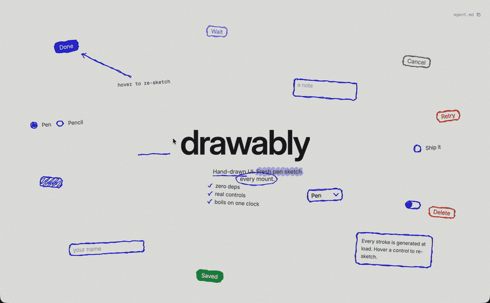
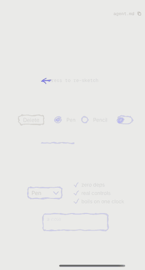
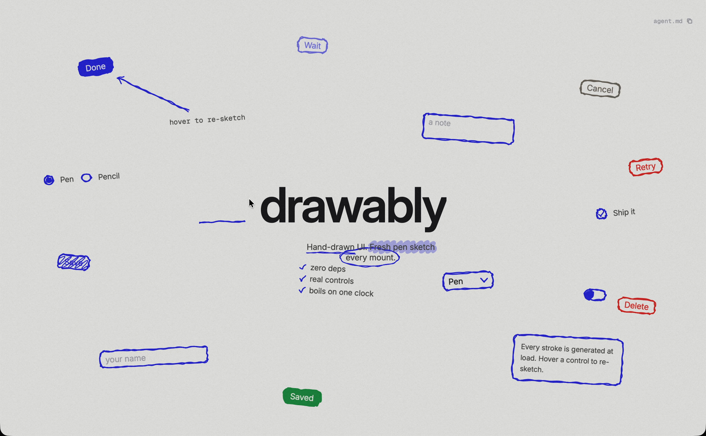
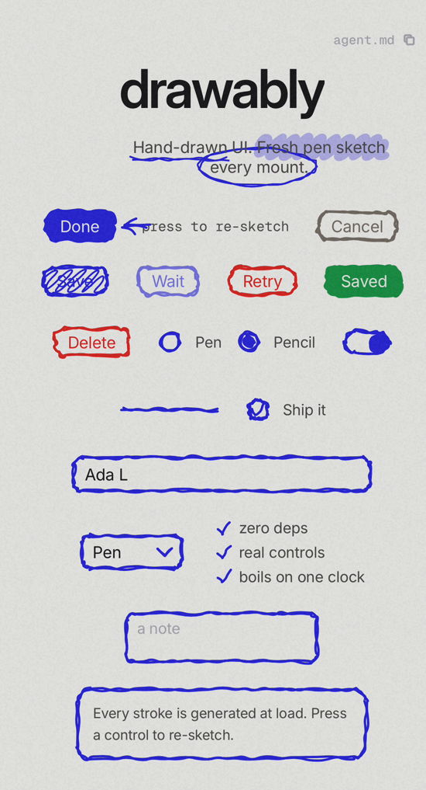
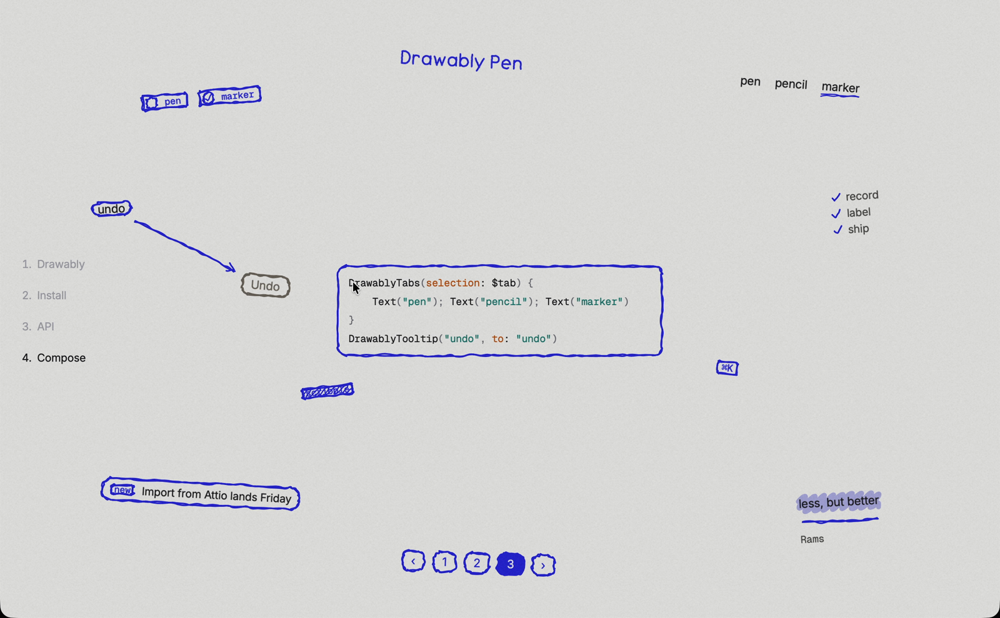
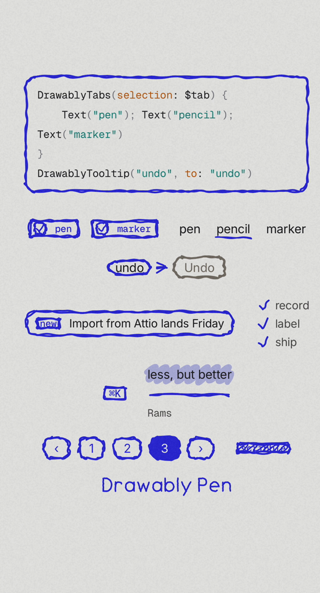
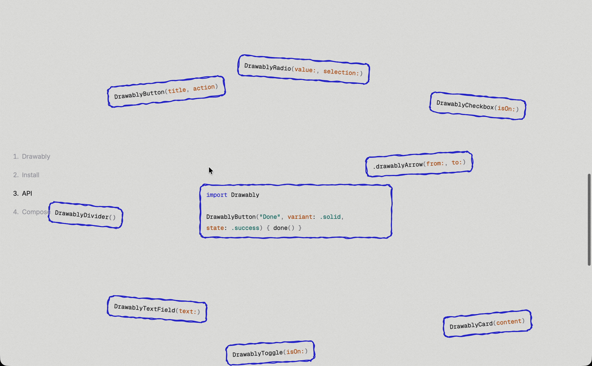

# Drawably for SwiftUI: hand-drawn, sketchy UI components for iOS and macOS

**Hand-drawn SwiftUI controls that look drawn with a pen.** Buttons, toggles, checkboxes, radio buttons, text fields, pickers, cards, badges, lists, underlines, highlights and arrows, each one a fresh pen sketch that *boils* like an animated doodle. It's a native SwiftUI port of the [drawably](https://github.com/danielwh2/drawably) web library, with bit-for-bit identical strokes.

[](https://swift.org)
[](#requirements)
[](#install)
[](LICENSE)

<p align="center">
  
  &nbsp;
  
</p>

<p align="center"><sub>Real recordings of the demo app, not mockups. Also as MP4: <a href="docs/media/demo-mac.mp4">macOS</a> · <a href="docs/media/demo-phone.mp4">iPhone</a></sub></p>

## Why Drawably

- **A fresh sketch on every mount.** Each control's strokes come from a seed, so no two renders look alike, or pass a `seed:` to reproduce one exactly.
- **Strokes that boil.** Three micro-wobbled frames cycle on one shared 1200ms clock, the classic hand-drawn animation effect.
- **Real SwiftUI controls underneath.** Bindings, keyboard focus, VoiceOver, hover (macOS and iPad) and Reduce Motion all work as usual.
- **Feels drawn by hand.** Hover or press re-sketches a control. Buttons lift and sink, checkmarks draw themselves in, radio dots pop and toggle knobs slide.
- **Identical to the web library.** The rough renderer is a line-for-line port, and tests compare it against drawably's own output.
- **No dependencies.** Inter, Geist Mono and the Drawably Pen handwriting font are bundled.

Useful for sketch-style apps, whiteboard, notes and journaling apps, playful onboarding, empty states, paywalls, kids' and education apps, game menus, and wireframe-style prototypes.

## Screenshots

| macOS / iPad (wide) | iPhone |
|---|---|
|  |  |
|  |  |
|  | |

## Install

**Swift Package Manager.** In Xcode, choose *File → Add Package Dependencies…*, then paste:

```
https://github.com/hemal08ce094/DrawablySwiftUI
```

Or add it to `Package.swift`:

```swift
.package(url: "https://github.com/hemal08ce094/DrawablySwiftUI", from: "0.1.0"),
// target: .product(name: "Drawably", package: "DrawablySwiftUI")
```

### Requirements

iOS 18, macOS 15 or visionOS 2. Swift 6 toolchain (Xcode 16 or later).

## Quick start

```swift
import SwiftUI
import Drawably

struct SettingsView: View {
    @State private var ship = true
    @State private var name = ""
    @State private var saving = false

    var body: some View {
        DrawablyCard {
            VStack(alignment: .leading, spacing: 16) {
                DrawablyTextField("your name", text: $name)
                DrawablyCheckbox("Ship it", isOn: $ship)
                DrawablyButton("Save", variant: .solid, state: saving ? .loading : .idle) {
                    saving = true
                }
            }
        }
        .padding()
        .drawably(stroke: .indigo, fill: .indigo, paper: .white)   // theme once
    }
}
```

## Components

### Controls

```swift
DrawablyButton("Done", variant: .solid) { submit() }        // .outline (default) | .solid | .scribble
DrawablyButton("Cancel", tone: .neutral)                     // .pen | .neutral | .danger
DrawablyButton("Save", state: saving ? .loading : .idle)     // .idle | .loading | .error | .success
Button("Any") { }.buttonStyle(.drawably(variant: .scribble)) // the same sketch as a ButtonStyle
DrawablyCheckbox("Ship it", isOn: $ship)
DrawablyRadio("Pen", value: "pen", selection: $ink)          // one selection binding groups them
DrawablyToggle(isOn: $on)
DrawablyTextField("your name", text: $name)
DrawablyTextEditor("a note", text: $note, rows: 4)
DrawablySelect(selection: $tool, options: ["Pen", "Pencil"]) // width reserved for the widest option
DrawablyDivider()
DrawablyCard { … }
DrawablyBadge("new", variant: .scribble)                     // .outline | .scribble
DrawablyList(marker: .check) { Text("a"); Text("b") }        // .dash | .check
```

Every control takes `seed:`. Leave it out for a unique sketch on each mount.

### Text decoration

```swift
Text("Hand-drawn").drawablyUnderline()
Text("fresh sketch").drawablyHighlight()
Text("$0").drawablyCircle()

// inside a sentence: one drawing per line the mark wraps onto
DrawablyText(Text("\(Text("Hand-drawn").drawably(.underline)) UI, a \(Text("fresh sketch").drawably(.highlight))."))
```

### Annotation arrows

```swift
VStack {
    Text("tap here").drawablyAnchor("note")
    DrawablyButton("Go").drawablyAnchor("go")
}
.drawablyArrow(from: "note", to: "go")
.drawablyArrows()   // draws every arrow declared inside
```

### Composites

```swift
DrawablyChip("pen", isOn: $pen)
DrawablyTabs(selection: $tab) { Text("a"); Text("b") }
DrawablyTooltip("undo", to: "undoButton")
DrawablyAlert(tag: "new") { Text("Import lands Friday") }
DrawablySteps { Text("record"); Text("label") }
DrawablyKbd("⌘K")
DrawablyQuote(Text("less, but better")) { Text("Rams") }
DrawablyPager(page: $page, count: 3)
```

### Theming

```swift
content.drawably(stroke: .black, fill: .black, paper: .white, width: 2, roughness: 1, boil: 0.3)
content.drawablyTheme { $0.error = .red; $0.font = .drawablyInter(17) }
Text("Hello").font(.drawablyPen(24))   // the library's strokes as a handwriting font
```

Set `boil: 0` for one static sketch. Reduce Motion freezes the boil and skips re-sketching automatically.

### Custom shapes

```swift
@State private var options = RoughOptions(seed: randomSeed())

Boiling(options) { o in
    RoughShape(o) { size, o in Rough.ellipse(size.width / 2, size.height / 2, 40, 24, o) }
        .stroke(.indigo, style: StrokeStyle(lineWidth: 2, lineCap: .round, lineJoin: .round))
}
```

The renderer offers `Rough.line`, `circle`, `ellipse`, `arrow`, `roundedRect`, `checkmark`, `scribbleFill` and `variants`, plus the seeded PRNG `Mulberry32` and `randomSeed()`.

## FAQ

**Does it match the web version of drawably?**
Yes. `Rough.swift` is a line-for-line port of drawably's `prng.js` and `rough.js`, down to V8's `Math.hypot` rounding. `swift test` compares paths against drawably 0.4.2's own output (`Tests/DrawablyTests/reference.json`).

**Is it accessible?**
The controls are real SwiftUI `Button`s and `TextField`s with toggle/selected traits and values, so VoiceOver and keyboard focus work. The sketches are decorative and hidden from accessibility.

**What about performance?**
Each sketch is a small `Shape` redrawn about 2.5 times a second, on a clock shared by every sketch. For lists with hundreds of rows, set `.drawably(boil: 0)`.

**Dark mode?**
Pass adaptive colours to `.drawably(stroke:fill:paper:)`. `paper` should be the colour behind the controls.

## Demo app

Open `Demo/DrawablyDemo.xcodeproj` and run it on iOS or macOS. It recreates drawably's example page, plus a board for the composites. Launch it with `-autoplay` to have it work the controls on a loop (that's how the recordings above were made).

## Repo layout

- `Sources/Drawably`: the library.
- `Tests/DrawablyTests`: parity tests against the JS renderer.
- `Demo/`: the iOS/macOS demo app, which uses the package locally.

## Credits

A SwiftUI port of [drawably](https://github.com/danielwh2/drawably) by Daniel Belyi (MIT). Inter and Geist Mono are bundled under the SIL Open Font License. MIT licensed; see [LICENSE](LICENSE).

<sub>Keywords: SwiftUI hand-drawn UI, sketchy UI, doodle UI kit, rough.js for Swift, pen sketch button, hand-drawn toggle, checkbox, iOS UI components, macOS SwiftUI library, whiteboard style, wireframe style, animated sketch, boiling line animation.</sub>
